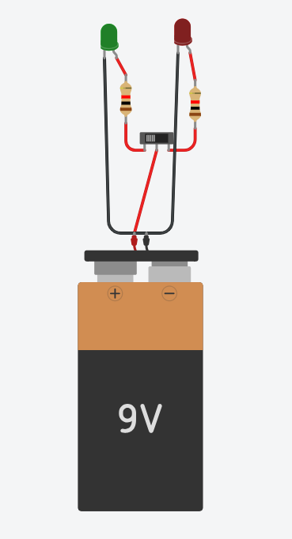
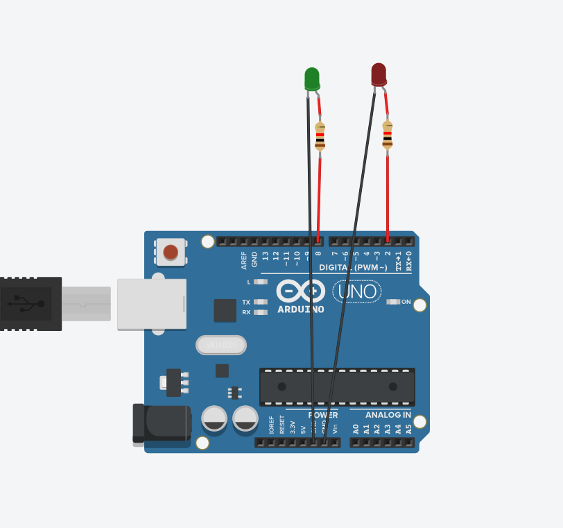
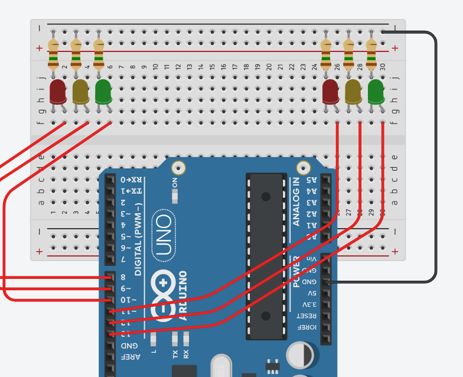
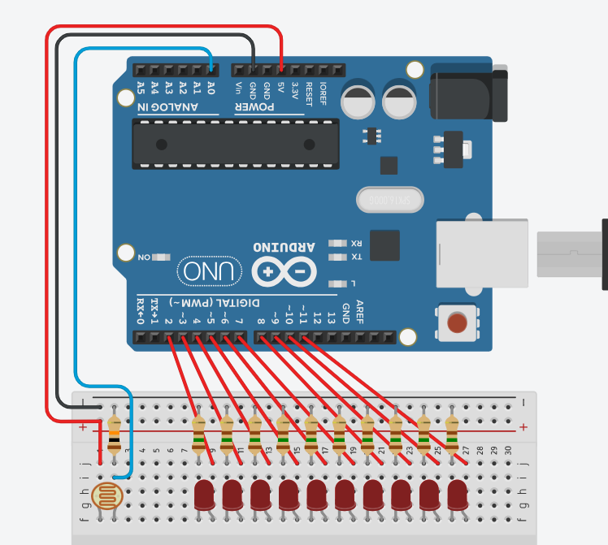
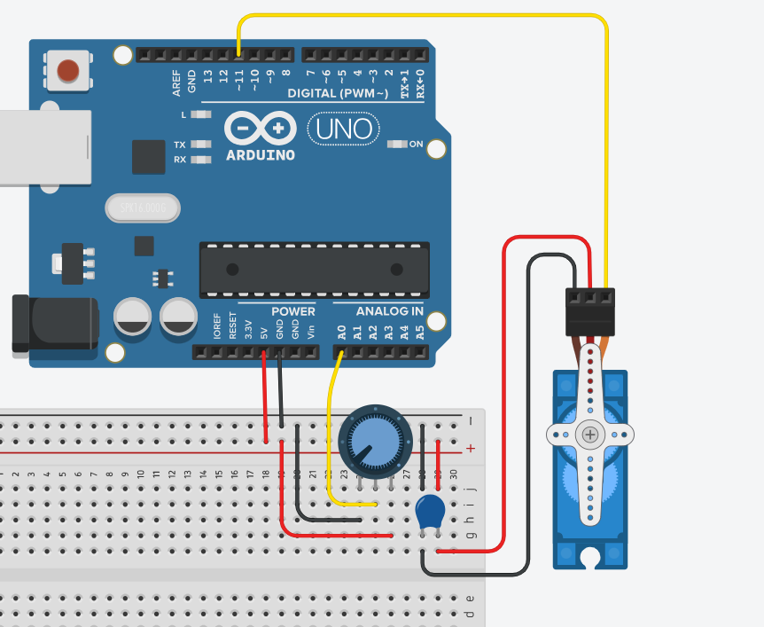
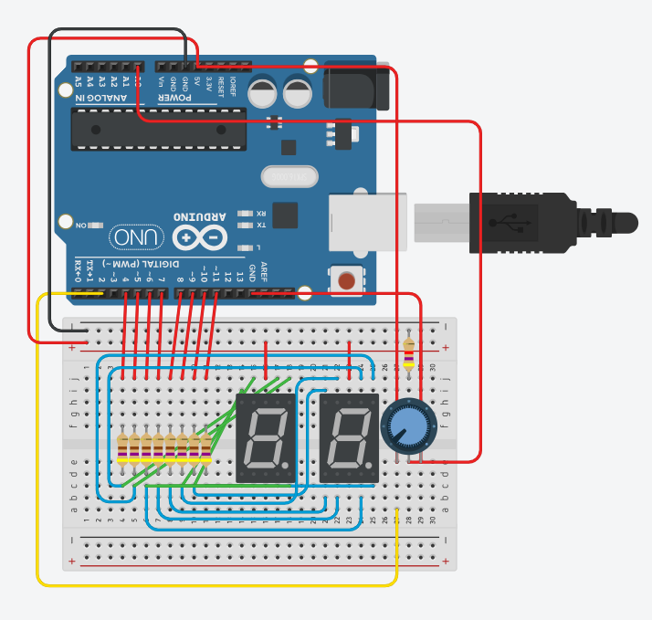
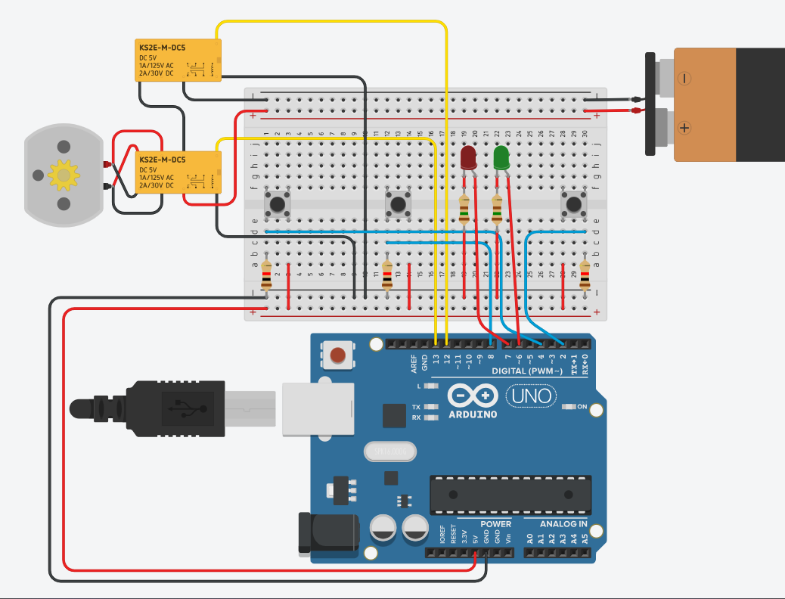
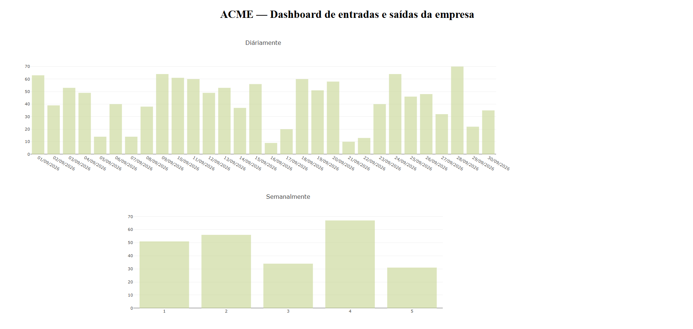

# Atividades de IOT

## Tecnologias:
- HTML, JS
- Linguagem C, Arduino
- VsCode

## Experimentos:

### Poste com e sem arduíno (aula 2):
1. Sem arduíno:


2. Com arduíno:

> Código:
```
int verde = 8;
int vermelho = 2;

void setup()
{
  pinMode(verde, OUTPUT);
  pinMode(vermelho, OUTPUT);
}

void loop()
{
  digitalWrite(verde, 1);
  digitalWrite(vermelho, 0);
  delay(1000);
  digitalWrite(verde, 0);
  digitalWrite(vermelho, 1);
  delay(1000);
}
```
---
### Semáforo de duas vias (aula 3):

> Código:
```
//lado esquerdo
//verde
int led1 = 10;
//amarelo
int led2 = 9;
//vermelho
int led3 = 8;


//lado direito
//verde
int led4 = 13;
//amarelo
int led5 = 12;
//vermelho
int led6 = 11;


void setup() {
  pinMode(led1, OUTPUT);
  pinMode(led2, OUTPUT);
  pinMode(led3, OUTPUT);

  pinMode(led4, OUTPUT);
  pinMode(led5, OUTPUT);
  pinMode(led6, OUTPUT);
}

void loop() {
  digitalWrite(led4, HIGH);
  digitalWrite(led5, LOW);
  digitalWrite(led6, LOW);

  digitalWrite(led3, HIGH);
  digitalWrite(led2, LOW);
  digitalWrite(led1, LOW);

  delay(5000);

  //------------------------//

  digitalWrite(led4, LOW);
  digitalWrite(led5, HIGH);

  delay(2000);

  //------------------------//
  
  digitalWrite(led5, LOW);
  digitalWrite(led6, HIGH);

  digitalWrite(led3, LOW);
  digitalWrite(led1, HIGH);

  delay(5000);

  //------------------------//
  
  digitalWrite(led1, LOW);
  digitalWrite(led2, HIGH);

  delay(2000);

//------------------------//
  
  digitalWrite(led2, LOW);
  digitalWrite(led3, HIGH);

  digitalWrite(led6, LOW);
}
```
---
### Pista de pouso (aula 3):

> Código:
```
código desafio 2, aula 3

int sensorLuminosidade = A0;

int leds[] = {2, 3, 4, 5, 6, 7, 8, 9, 10, 11};

void setup() {
  for (int i = 0; i < 10; i++) {
    pinMode(leds[i], OUTPUT);
  }
}

void loop() {

  int nivelDeLuz = analogRead(sensorLuminosidade);

  // Converte a luminosidade em quantidade de LEDs.
  // Pouca luz = 10 LEDs
  // Muita luz = 0 LEDs
  int quantidadeLeds = map(nivelDeLuz, 0, 900, 10, 0);

  quantidadeLeds = constrain(quantidadeLeds, 0, 10);

  for (int i = 0; i < 10; i++) {

    if (i < quantidadeLeds) {
      digitalWrite(leds[i], HIGH);
    } else {
      digitalWrite(leds[i], LOW);
    }

  }

  delay(50);
}
```
---
### Servomotor (aula 4):

> Código:
```
int motor = 11;
int potenc = 0;
int angulo = 0;
int tempo = 0;

void setup() {
  pinMode(motor, OUTPUT);
}

void loop() {
  potenc = analogRead(A0);
  angulo = map(potenc, 0, 1023, 0, 180);
  tempo = map(angulo, 0, 180, 1000, 2000);
  
  digitalWrite(motor, HIGH);
  delayMicroseconds(tempo);

  digitalWrite(motor, LOW);
  delayMicroseconds(20000 - tempo);
}
```
---
### Experimento com display (aula 4):

> Código:
```
int a = 4;
int b = 5;
int c = 6;
int d = 7;
int e = 8;
int f = 9;
int g = 10;
int entrada[7] = {a, b, c, d, e, f, g};

// Display de 7 segmentos
int display[10][7] = {
  {a,b,c,d,e,f,-1},       // 0
  {b,c,-1,-1,-1,-1,-1},   // 1
  {a,b,d,e,g,-1,-1},      // 2
  {a,b,c,d,g,-1,-1},      // 3
  {b,c,f,g,-1,-1,-1},     // 4
  {a,c,d,f,g,-1,-1},      // 5
  {a,c,d,e,f,g,-1},       // 6
  {a,b,c,-1,-1,-1,-1},    // 7
  {a,b,c,d,e,f,g},        // 8
  {a,b,c,d,f,g,-1}        // 9
};


// Controle para evitar contagem automática
bool pronto = true;
void setup() {
  for (int i = 0; i < 7; i++) {
    pinMode(entrada[i], OUTPUT);
  }
  pinMode(A0, INPUT);

  numero(1);
}

void loop() {
  int valor = analogRead(A0);

  int num = map(valor, 0, 1023, 1, 9);
  numero(num);
  delay(50);
}

void numero(int coluna) {
  // Desliga tudo
  for (int i = 0; i < 7; i++) {
    digitalWrite(entrada[i], HIGH);
  }
  
  for (int i = 0; i < 7; i++) {
    if (display[coluna][i] != -1) {
      digitalWrite(display[coluna][i], LOW);
    }
  }
}
```
--- <br>
### Simulador de portão (aula 4):

> Código:
```
const int releMotor = 12;
const int releDirecao = 13;

// BOTÕES
const int botaoAbrir = 4;
const int botaoParar = 8;
const int botaoFechar = 2;

// LEDS
const int ledVermelho = 6;
const int ledVerde = 7;

void setup() {
  pinMode(releMotor, OUTPUT);
  pinMode(releDirecao, OUTPUT);

  pinMode(botaoAbrir, INPUT);
  pinMode(botaoParar, INPUT);
  pinMode(botaoFechar, INPUT);

  pinMode(ledVermelho, OUTPUT);
  pinMode(ledVerde, OUTPUT);

  // Motor desligado ao iniciar
  digitalWrite(releMotor, LOW);

  // Sentido inicial
  digitalWrite(releDirecao, LOW);
}


// PROGRAMA PRINCIPAL
void loop() {
  int abrir = digitalRead(botaoAbrir);
  int parar = digitalRead(botaoParar);
  int fechar = digitalRead(botaoFechar);


  // BOTÃO D4 - ABRIR
  if (abrir == HIGH) {
    digitalWrite(releDirecao, LOW);
    digitalWrite(releMotor, HIGH);
  }

  // BOTÃO D2 - FECHAR
  if (fechar == HIGH) {
    digitalWrite(releDirecao, HIGH);
    digitalWrite(releMotor, HIGH);
  }

  // BOTÃO D8 - PARAR
  if (parar == HIGH) {
    digitalWrite(releMotor, LOW);
  }

  // LEDS DE SINALIZAÇÃO DA SAÍDA
  digitalWrite(ledVermelho, HIGH);
  digitalWrite(ledVerde, LOW);
  delay(500);

  digitalWrite(ledVermelho, LOW);
  digitalWrite(ledVerde, HIGH);
  delay(500);
}
```

### Gráficos da simulação do portão:

